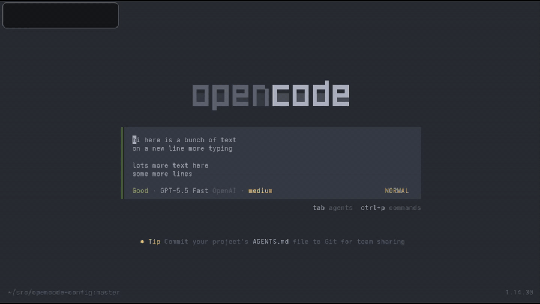

# opencode-vim

Adds Vim-style insert and normal mode editing to the OpenCode prompt.



## Installation

Install from the CLI:

```bash
opencode plugin opencode-vim@latest --global
```

See [docs/configuration.md](./docs/configuration.md) for configuration options and keymap examples.
